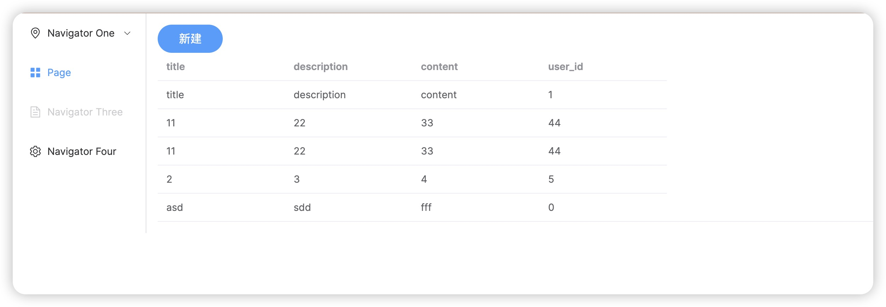
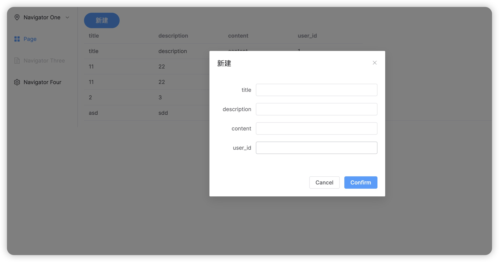

## Development Guide

### Screenshots



### Running the application
```bash
rails s
```

### Running the yarn server
```bash
yarn dev-build
```

### Runing the tailwindcss server
```bash
rails tailwindcss:watch
```